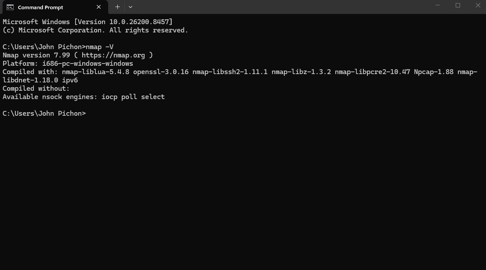
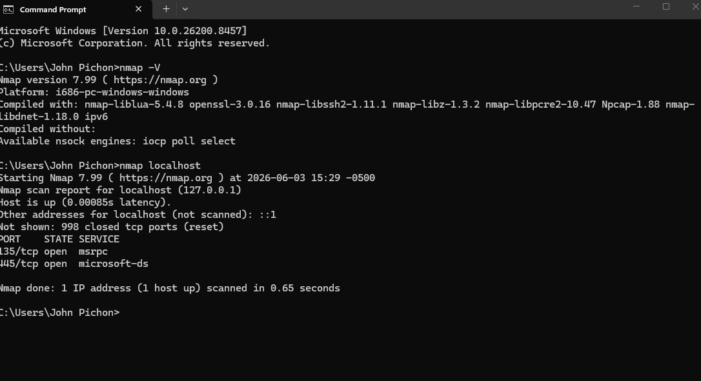
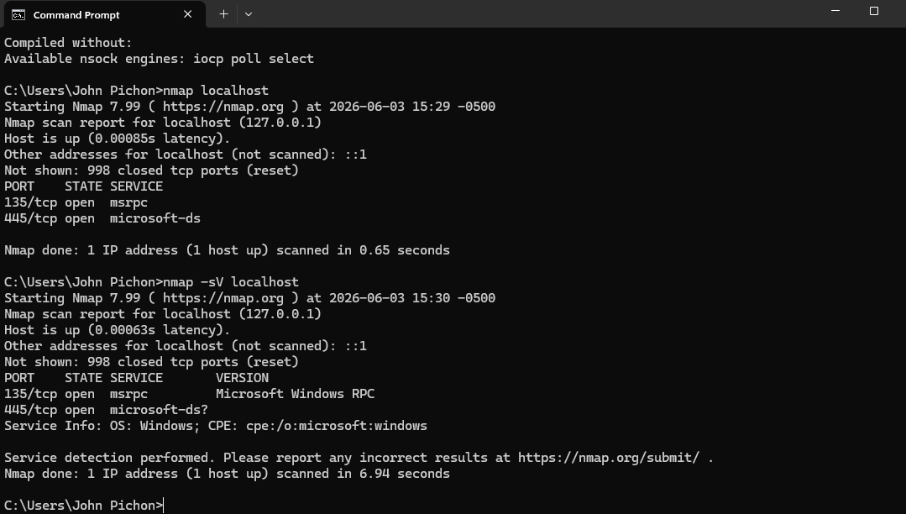

# Nmap Localhost Port Scan

## Objective

Use Nmap to identify open ports and running services on a local Windows host.

## Tools

- Nmap 7.99
- Windows 11

## Commands Used

## Commands Used

```bash
nmap localhost
nmap -sV localhost

Notice the closing triple backticks after the commands.

---

### Also check your folder name

I see the folder is named:

```text
screenshot



